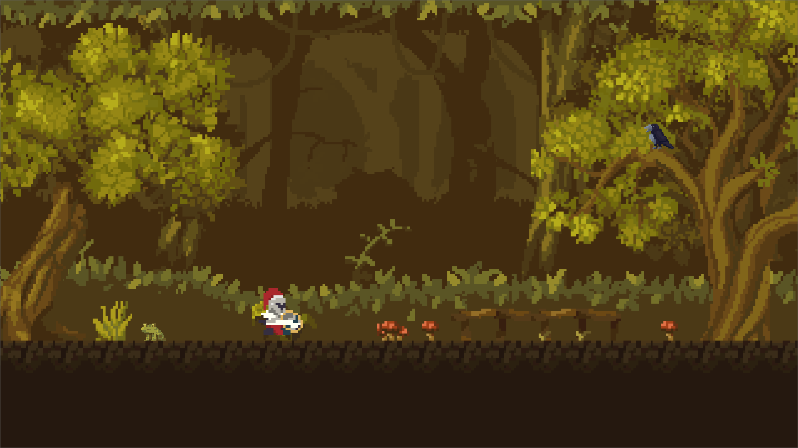

# Blood Experiment Platformer

## 🇬🇧 English

This is just a part of my 2D game that I'm developing solo in **Godot**. Many features are still missing — so far the game is only available in **Polish**. Adjustable settings, multi-language support, player's inventory, NPCs, enemies, collectibles, music, sound effects, and many other features are on the way. I also plan to reorganize scenes and scripts soon.

### 🧬 Upcoming Plot

As the main character, you'll search for a trustworthy doctor or resources. You find yourself in a forest after a mysterious break from life. Strange marks on your skin suggest possible injections — you fear you’ve been infected and that viruses are killing you from within. Your character becomes weaker with each level.

You must find a way to examine your blood. Can the doctor be trusted? You begin your journey equipped with medieval armor, a sword, and a shield — found in the forest after a party...

### 🎨 Art Credits

- [Pixel Valley Platform Tiles by Kauzz](https://kauzz.itch.io/pixel-valley-plataform-tiles)
- [Starstring Fields by Trixelized](https://trixelized.itch.io/starstring-fields)
- [Knight Hero Platform by Pixivan](https://pixivan.itch.io/knight-hero-platfor)
- [Crow by Shiaxs](https://shiaxs.itch.io/crow)
- [Dark-owl-sprites by thespriteshop](https://thespriteshop.itch.io/dark-owl-sprites)

### 🤖 AI Tools Used

- Microsoft Copilot

then GitHub Copilot, ChatGPT and BIELIK.AI

------

A mobile version is coming soon… or maybe **you** can build it too! That would be amazing 😄  
Just don’t forget to share it with me! Feel free to fix the logic — I barely thought while developing this 😅 (You know what I mean) ]:> 

------

## 🇵🇱 Polski

To tylko fragment mojej gry 2D, którą tworzę samodzielnie w **Godot**. Wiele funkcji jeszcze brakuje — obecnie gra jest dostępna tylko w **języku polskim**. Konfigurowalne opcje, inne języki, ekwipunek gracza, postacie niezależne (NPC), przeciwnicy, kolekcje, muzyka i efekty dźwiękowe — wszystko to dopiero powstaje. Planuję też przearanżować sceny i skrypty.

### 🧬 Nadchodząca Fabuła

Jako główny bohater będziemy szukać lekarza lub zasobów, którym można zaufać. Budzimy się w lesie po przerwie od życia, a na skórze dostrzegamy dziwne ślady — być może po igłach. Zakładamy, że zostaliśmy zarażeni i wirusy zabijają nas od środka. Postać słabnie z każdym poziomem.

Poszukujemy sposobu, by zbadać naszą krew. Czy lekarz jest godny zaufania? Zaczynamy w średniowiecznej zbroi, z mieczem i tarczą — znalezionymi w lesie po imprezie...

### 🎨 Autorzy grafiki

- [Pixel Valley Platform Tiles by Kauzz](https://kauzz.itch.io/pixel-valley-plataform-tiles)
- [Starstring Fields by Trixelized](https://trixelized.itch.io/starstring-fields)
- [Knight Hero Platform by Pixivan](https://pixivan.itch.io/knight-hero-platfor)
- [Crow by Shiaxs](https://shiaxs.itch.io/crow)
- [Dark-owl-sprites by thespriteshop](https://thespriteshop.itch.io/dark-owl-sprites)

### 🤖 Najczęściej używane narzędzia AI

- Microsoft Copilot

później GitHub Copilot, Chat GPT, BIELIK.AI

------

Wersja mobilna już w drodze — albo Ty możesz ją stworzyć! Będzie super 😄  
Tylko nie zapomnij mi pokazać! Popraw logikę — prawie nie myślałem rozwijając to 😅 (Wiesz co mam na myśli) ]:>
